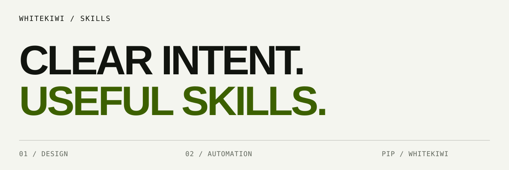

<picture>
  <source media="(prefers-color-scheme: dark)" srcset="assets/skills-cover-dark.svg">
  <source media="(prefers-color-scheme: light)" srcset="assets/skills-cover-light.svg">
  
</picture>

# WhiteKiwi Skills

**Focused workflows. Explicit boundaries. Verified outcomes.**

Portable agent skills for design guidelines, local schedules, and personal notifications. Install only what you need.

[Choose a skill](#choose-a-skill) · [Install](INSTALL.md) · [Workflows](docs/workflows.md) · [Distribution](docs/distribution.md) · [Maintain](docs/maintaining.md)

## Choose a skill

| You want to… | Use | What you get |
|---|---|---|
| Establish or substantially revise a visual system | **[Create Design Guideline](skills/create-design-guideline/SKILL.md)** | An evidence-backed canonical guideline, semantic tokens, theme rules, and an adoption plan |
| Audit or implement a product's design system | **[Design Guidelines](skills/design-guidelines/SKILL.md)** | Prioritized findings, reusable design decisions, and visual QA for authorized changes |
| Find out why a local job did not run | **[Locron](skills/locron/SKILL.md)** | Version-aware diagnosis, dry-run previews, and exact-target verification |
| Get a personal iPhone notification | **[Pushman](skills/pushman/SKILL.md)** | Authorized sends, delivery checks, and protection against duplicate retries |

**Which design skill?** Start with `create-design-guideline` for a new or major-revision guideline. Choose `design-guidelines` for broader creation, audits, or implementation. Each is self-contained; neither requires the other.

## Quick start

### Portable skills

With Node.js/npm and Git available, list the collection first:

```sh
npx skills add WhiteKiwi/skills --list
```

Then choose a skill and your agent interactively:

```sh
npx skills add WhiteKiwi/skills --skill create-design-guideline
```

The [Vercel skills CLI](https://github.com/vercel-labs/skills) supports clients including Cursor, Gemini CLI, GitHub Copilot, OpenCode, and Hermes. Installation support does not guarantee that every client exposes the same tools. Review the selected destination and back up existing same-name skills before replacing them. [Client-specific commands →](INSTALL.md)

### Native clients

<details open>
<summary><strong>Hermes Agent</strong> · GitHub tap, no separate registry account</summary>

```sh
hermes skills tap add WhiteKiwi/skills
hermes skills inspect WhiteKiwi/skills/skills/create-design-guideline
hermes skills install WhiteKiwi/skills/skills/create-design-guideline
```

Uses the authored `skills/` directories and their supporting files. Review Hermes' community-skill scan before installing; no force flag is needed in the documented path.

</details>

<details>
<summary><strong>Claude Code</strong> · independent plugins</summary>

```sh
claude plugin marketplace add WhiteKiwi/skills
claude plugin install create-design-guideline@whitekiwi-skills
```

</details>

<details>
<summary><strong>Codex / ChatGPT</strong> · independent plugins</summary>

```sh
codex plugin marketplace add WhiteKiwi/skills
codex plugin add create-design-guideline@whitekiwi-skills
```

Use the installed client's plugin catalog UI where available. CLI commands apply to Codex CLI.

</details>

<details>
<summary><strong>OpenClaw</strong> · ClawHub or local payload</summary>

```sh
openclaw skills install @whitekiwi/create-design-guideline
```

This requires a published ClawHub version. A GitHub push alone does not publish to ClawHub. For unpublished versions, clone the repository and install the generated local payload using [the installation guide](INSTALL.md).

</details>

Replace `create-design-guideline` with `design-guidelines`, `locron`, or `pushman`. Adding a catalog never means installing the entire collection.

## Try it

```text
Use create-design-guideline to create a brand and product guideline for this app.
Use design-guidelines to audit our light/dark themes and interaction states.
Use locron to explain why the backup job did not run.
Use pushman to notify me when this task finishes.
```

| Workflow | Prerequisites |
|---|---|
| Both design skills | Product context and assets; Node.js for the bundled contrast checker, or an equivalent verified measurement |
| Locron | [Locron CLI](https://github.com/WhiteKiwi/locron#installation) on `PATH`; workflow tested through 0.9.2 |
| Pushman | [Pushman CLI](https://github.com/pushmanhq/pushman-cli/blob/main/docs/INSTALL.md) 0.1.1+, authorized account/device; optional local MCP |

An instruction-only client can use the guidance, but CLI operations, browser research, and rendered UI checks require the corresponding tools. Installing a skill does not install those tools or authenticate their services.

[Detailed workflow examples and setup →](docs/workflows.md)

## Small workflows, clear boundaries

- **Evidence before action.** Inspect the installed tool and current state before making changes
- **Authorization stays scoped.** A guideline, audit, or draft request does not authorize deployment or a notification
- **Verification is explicit.** Measure color pairs, read back changed jobs, and distinguish accepted sends from confirmed delivery
- **One source, independent releases.** Authored skills generate platform packages with per-skill versions and reproducible checksums

<details>
<summary><strong>Design helper: measure contrast without guessing</strong></summary>

From either installed design skill's directory:

```sh
node scripts/contrast-check.mjs '#171717:#C6FF4A'
node scripts/contrast-check.mjs --min 4.5 --json '#171717:#C6FF4A'
```

Report mode measures without failing on low contrast. `--min` enables a gate. Exit codes: `0` for a report or passing gate, `1` for a missed threshold, `2` for invalid input. The helper accepts opaque sRGB hex pairs; resolve alpha, CSS tokens, OKLCH, or P3 separately. Color-pair checks alone do not establish WCAG conformance.

</details>

## Verification

[](https://github.com/WhiteKiwi/skills/actions/workflows/validate.yml)

Builds, generated adapters, contrast helpers, and regression tests run in CI. See [Actions](https://github.com/WhiteKiwi/skills/actions) for the exact checked revision. Runtime-dependent checks are reported separately when their tools are absent.

## For maintainers

```sh
git clone https://github.com/WhiteKiwi/skills.git
cd skills
./scripts/validate.sh
```

Python 3 and Node.js run the local build and tests. Optional official validators are detected when installed; CI installs its pinned validators.

```text
skills/          Authored, portable workflows
catalog.json     Independent versions and packaging metadata
plugins/         Generated Claude / Codex plugins
platforms/       Generated OpenClaw payloads
skills.sh.json   Generated discovery categories for skills.sh / Hermes
scripts/         Deterministic build, validation, release
tests/           Packaging, safety, and behavior regressions
```

Change sources, rebuild, validate, then commit. Keep the new `create-design-guideline` workflow independent. [Build and release guide →](docs/maintaining.md)

## Distribution status

Hermes can consume this public repository as a community tap. The portable source is ready for the skills CLI; skills.sh discovery depends on real installs and indexing. Neither means an official endorsement or a guaranteed store listing.

[Supported routes, publication requirements, and other directories →](docs/distribution.md)

## Design

Repository artwork follows [PIP, the WhiteKiwi design system](https://design.whitekiwi.link/): quiet neutral canvas, editorial type, and one kiwi signal. [Artwork contract and source values](docs/repository-design.md). The installable skills remain brand-agnostic.

## License

[MIT-0](LICENSE) for this catalog and its skill artifacts. External tools retain their own licenses; no Locron or Pushman implementation code is bundled.
